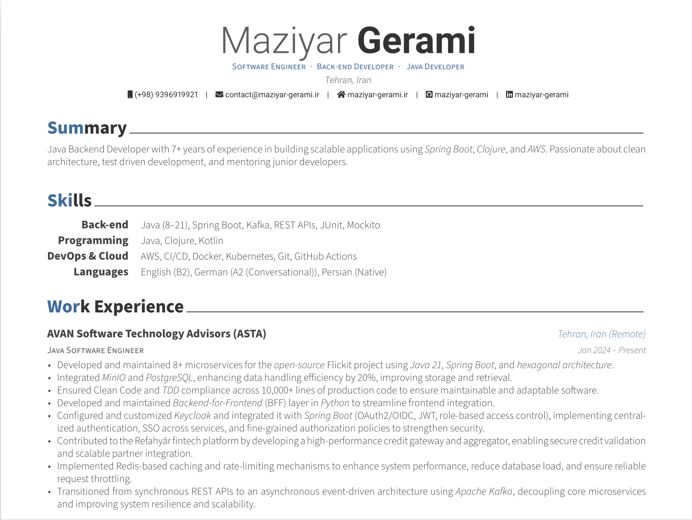

# CV and Resume

This repository contains my professional CV and resume written in LaTeX.

The project is built using **LuaLaTeX** for modern font handling and high-quality PDF generation.



## Repository Structure

```text
.
├── resume.tex
├── cv.tex
├── assets/
├── fonts/
└── output/
```

## Requirements

Before building the project, install a LaTeX distribution that includes `lualatex`.

### Ubuntu / Debian

```bash
sudo apt update
sudo apt install texlive-full
```

Or install only the required packages:

```bash
sudo apt install texlive-luatex texlive-fonts-extra texlive-latex-extra
```

### Arch Linux

```bash
sudo pacman -S texlive-most
```

### macOS

Install MacTeX:

```bash
brew install --cask mactex
```

### Windows

Install one of the following:

* MiKTeX
* TeX Live

## Build Resume

Generate the PDF using:

```bash
lualatex resume.tex
```

Generate the CV using:

```bash
lualatex cv.tex
```

## Output

After compilation, the generated PDF files will be available in the project directory.

## Why LuaLaTeX?

LuaLaTeX provides:

* Better Unicode support
* Modern font handling
* Improved typography
* Easier multilingual support

## Useful Links

* LuaLaTeX Documentation: https://www.luatex.org/
* TeX Live: https://www.tug.org/texlive/
* Overleaf: https://www.overleaf.com/

## License

This repository is available for educational and personal inspiration purposes.
